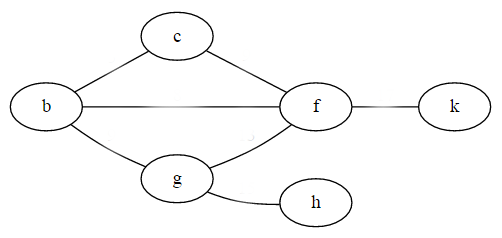

# Problem 87b

Extract nodes from a graph into a list in [breadth-first order](https://en.wikipedia.org/wiki/Breadth-first_search), without repeating any nodes.

##Example

```elm

breadthFirst 'c' graph == ['c', 'b', 'f', 'g', 'k', 'h']
```

##Unit Test
```elm
import Html
import List
import Set
import String


{-| A node has a value, degree and a color
-}
type alias Edge comparable =
    ( comparable, comparable )


type alias Graph comparable =
    ( List comparable, List (Edge comparable) )


{-| Given a graph and a starting node, return all nodes in depth-first order.
-}
breadthFirst : comparable -> Graph comparable -> List comparable
breadthFirst start (nodes, edges) =
    breadthFirst' [start] [] (nodes, edges)


{-| Helper function for breadthFirst that recordes visited nodes to avoid
    cyclic paths.
-}
breadthFirst' : List comparable -> List comparable -> Graph comparable -> List comparable
breadthFirst' unvisited visited ( nodes, edges ) =
    case unvisited of
        [] ->
            visited
           
        u::us ->
            let
                nextNodes = unique
                    <| List.map (snd)
                    <| (++) (List.filter (\( a, b ) -> a == u) edges)
                    <| List.map (\x -> ( snd x, fst x ))
                    <| List.filter (\( a, b ) -> b == u) edges

                newNodes = List.sort
                    <| List.filter (\x -> not (List.member x (u::visited))) nextNodes
            in
                breadthFirst' (remove u (unvisited ++ newNodes)) (visited ++ [u]) (nodes, edges)


remove : a -> List a -> List a
remove x =
  List.filter ((/=) x)
  

{-| Given a list, return all unique values in the list.
-}
unique : List comparable -> List comparable
unique list =
    Set.toList <| Set.fromList list


main' = Html.text <| toString <| String.fromList (breadthFirst 'g' graph84)
main : Html.Html a
main =
    Html.text
        <| case test of
            0 ->
                "Your implementation passed all tests."

            1 ->
                "Your implementation failed one test."

            x ->
                "Your implementation failed " ++ (toString x) ++ " tests."


test : Int
test =
    List.length
        <| List.filter ((==) False)
            [ String.fromList (breadthFirst 'g' graph80) == "gh"
            , String.fromList (breadthFirst 'h' graph80) == "hg"
            , String.fromList (breadthFirst 'g' graph84) == "gbfhck"
            , String.fromList (breadthFirst 'c' graph84) == "cbfgkh"
            , String.fromList (breadthFirst 'f' graph84) == "fbcgkh"
            , String.fromList (breadthFirst 'h' graph84) == "hgbfck"
            , String.fromList (breadthFirst 'k' graph84) == "kfbcgh"
            , String.fromList (breadthFirst 'b' graph80) == "bcfk"
            , String.fromList (breadthFirst 'c' graph80) == "cbfk"
            , String.fromList (breadthFirst 'f' graph80) == "fbck"
            , String.fromList (breadthFirst 'k' graph80) == "kfbc"
            , String.fromList (breadthFirst 'k' graph80) == "kfbc"
            , String.fromList (breadthFirst 'g' graph81) == "gh"
            , String.fromList (breadthFirst 'h' graph81) == "hg"
            -- either ordering is acceptable
            , List.member (String.fromList (breadthFirst 'b' graph84)) ["bcfgkh", "bcfghk"]
            ]


graph80 =
    ( [ 'b', 'c', 'd', 'f', 'g', 'h', 'k' ]
    , [ ( 'b', 'c' )
      , ( 'b', 'f' )
      , ( 'c', 'f' )
      , ( 'f', 'k' )
      , ( 'g', 'h' )
      ]
    )


graph81 =
    -- has a loop and parallel edges
    ( [ 'b', 'c', 'd', 'f', 'g', 'h', 'k' ]
    , [ ( 'b', 'c' )
      , ( 'b', 'f' )
      , ( 'c', 'f' )
      , ( 'f', 'k' )
      , ( 'g', 'h' )
      , ( 'g', 'h' )
      , ( 'g', 'g' )
      ]
    )


graph84 =
    ( [ 'b', 'c', 'd', 'f', 'g', 'h', 'k' ]
    , [ ( 'b', 'c' )
      , ( 'b', 'f' )
      , ( 'b', 'g' )
      , ( 'c', 'f' )
      , ( 'f', 'g' )
      , ( 'f', 'k' )
      , ( 'g', 'h' )
      ]
    )
```
#Hint
1. One approach is to keep track of all nodes you have already visited as you traverse the graph

##Solution
[Solution](../s/s87.md)
